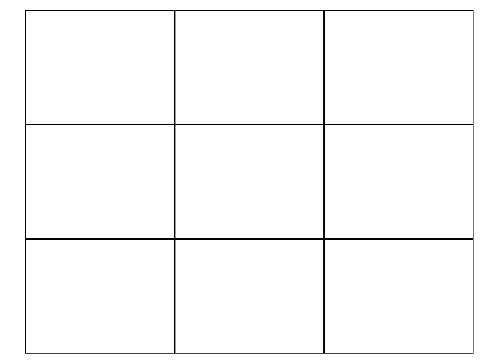

# Tic Tac Toe - Weekend Lab

**Objective:** Build a tic-tac-toe game in HTML, CSS, and JavaScript.

This week, we've been learning about working with conditionals and loops, as well as writing functions. We've also learned about the structure of the DOM and how we can interact with it using CSS and JavaScript. We've looked at Bootstrap's CSS library and at jQuery, a JavaScript library for front end web development.

For your first weekend lab, we'll be making a tic-tac-toe game using your knowledge and skills from this week.

## Base Goals
* Users should be able to click on any empty square to make a move.   
* Every move should alternate between marking an `X` and `O` (the two players).  
* A cell should not be able to changed once marked.  
* Users should be able to click a "reset" button to clear all the `X`s and `O`s from the board.  

## Stretch Goals

* Display a message to indicate whose turn it is (which player's mark is about to be played).    
* If a player wins (by drawing three of their mark in a row, column, or diagonal), alert the winner and reset the game!   
* Creatively style your tic-tac-toe site.  

## Suggested Workflow

**Set up repository, files, and basic structure.**

1. Fork this repository to create a copy on your GitHub account.
1. Clone the tic-tac-toe repository from *your GitHub account* into your `dev` folder to create a local copy on your computer.

2. Use `index.html` as your starting point on this project. There is already some starter code in `index.html`, `styles.css`, and `ticTacToe.js`. 

1. Make sure that jQuery and Bootstrap's CSS are linked in your `index.html`. Also link your custom CSS and JavaScript files to your `index.html`.

3. Test that your CSS and JavaScript files are linked to your `index.html` by adding an alert to `ticTacToe.js` and opening `index.html` in the browser. You should see part of an empty tic-tac-toe game board, and you should also see your alert message pop up.

1. Use Bootstrap's grid system to create the rest of the empty tic-tac-toe game board. The empty board should look like this:

    

1. Add a reset button below the board.

**Gameplay: **

4. Use the `$()` jQuery function with CSS selectors to locate each of the DOM elements your user will click. Try this in your console to make sure your selection works.  

1. After you find the elements, use `.on` to set up a simple `click` event listener for those elements. Start by having your event listener function just log a message that the element was clicked.  

1. Most of your game logic will happen when a user clicks one of the squares on the board.  Here are some hints:

  * You'll need to check whether a square is empty. 
  * You will also need a to keep track of whose turn it is. This will be used to indicate whether to draw an `X` or an `O`.  Try storing the turn as a variable. 
  * Write a separate function to check who has won (if anyone). What are the ways to win tic-tac-toe?  When will you need to call this function?
  * You will need to know if the board is completely full, because that means there has been a tie. How many moves could possibly be made in one game?

1. Make the reset button change the board back to its initial empty configuration. It will also need to reset any extra variables you're using to track progress through the game.

**Submission**: 

1. Create a `tic-tac-toe` directory inside your homework directory.  

1. Copy over your `index.html`, `styles.css`, and `ticTacToe.js` from your `dev/tic-tac-toe` directory to your `22-homework/tic-tac-toe` or `23-homework/tic-tac-toe` directory.

1. Change directories into the new `tic-tac-toe` directory inside your homework directory. List all the files with `ls -a`. 

1. If you are *sure* that you are inside your new homework `tic-tac-toe` directory and you see a `.git` directory listed there, run `rm -rf .git` to remove the `.git` file. (We don't want a whole tic-tac-toe repository nested inside your homework repository -- that would get too complicated!)

1. Follow the directions from your homework repo readme to push your changes and submit a new pull request.

